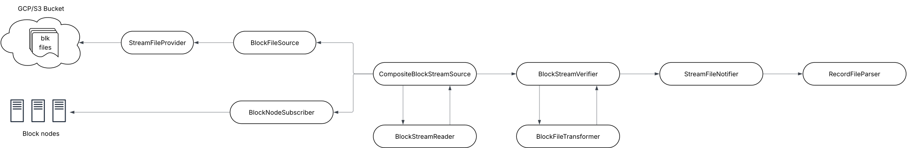

# HIP-1081 Block Node

## Purpose

[HIP-1081](https://hips.hedera.com/hip/hip-1081) introduces block node, a new node type that is designed to parse the
block stream, store latest state and serve up additional network APIs such as state proofs and block retrieval that
support decentralized querying and verification of state.

This design document concerns the support of streaming blocks from block nodes in mirror nodes.

## Goals

- Support streaming blocks from block nodes
- Support automatically switching the source from cloud storage to block nodes

## Non-Goals

- Removal of downloading block stream files from cloud storage
- Retrieve a state snapshot and bootstrap

## Architecture

### Database

Since block nodes don't have a node id, the `not null` constraint of the `node_id` column in `record_file` table needs
to be dropped.

```sql
alter table if exists record_file alter column node_id drop not null;
```

### Data Flow



Note: The diagram amends the block streams data flow with block node support

## Importer

- Add new configuration properties to `BlockPollerProperties` to support block nodes
- Add an abstract class `AbstractBlockStreamPoller`
- Move block file downloading in `BlockStreamPoller` to a new class `BlockFilePoller`
- Add new class `BlockNodePoller` to support streaming blocks from block nodes
- Rename `BockFileReader` to `BlockStreamReader`, and `ProtoBlockFileReader` to `ProtoBlockStreamReader`

### Interfaces and Classes

### BlockNodeAddress

```java
public class BlockNodeAddress {
    private String host;
    private int port;
}
```

### SourceType

```java
public enum SourceType {
    BLOCK_NODE,
    BOTH,
    FILE
}
```

### BlockPollerProperties

Add new configuration properties to the existing class

```java
public class BlockPollerProperties {
    ...
    private Collection<BlockNodeAddresses> blockNodes = Collections.emptyList();
    private SourceType sourceType = SourceType.BOTH;
}
```

### BlockStream

`BlockStream` represents a block from a downloaded block file, or a block streamed from a block node. The `filename`
is the downloaded block file's name, or generated from the block number without the `.blk.gz` suffix. `nodeId`
indicates which node the block file is downloaded from, or `null` if data is streamed from a block node.

```java
public record BlockStream(List<BlockItem> blockItems, String filename, Long nodeId) {}
```

### BlockStreamReader

This is renamed from `BlockFileReader`. Note the interface no longer extends `StreamFileReader` because it now reads
a `BlockStream` instead of a `StreamFileData`.

```java
public interface BlockStreamReader {
    BlockFile read(BlockStream blockStream);
}
```

### AbstractBlockStreamPoller

```java
abstract class AbstractBlockStreamPoller implements StreamPoller {

    protected final long getNextBlockNumber() {}

    protected final void onBlockStream(BlockStream blockStream) {
        read block stream;
        veriy block stream;
    }
}
```

### BlockFilePoller

`BlockFilePoller` polls a block file using `StreamFileProvider`, and calls `AbstractBlockStreamPoller.onBlockStream`.

```java
public class BlockFilePoller extends AbstractBlockStreamPoller {

    @Override
    public void poll() {
        call getNextBlockNumber;
        for each node
            try
                download the block file from the node
                call onBlockStream
                return
            catch error and continue to next node
    }
}
```

### BlockNodePoller

`BlockNodePoller` streams blocks from a list of block nodes in round-robin. At any time, `BlockNodePoller` should only
communicate with one block node. Upon any error during streaming and block processing, `BlockNodePoller` should clean up
resources created for the connection with the block node and throw exception so `CompositeBlockStreamPoller` can
maintain health status and switch to `BlockFilePoller` if needed.

`BlockNodePoller` should call `serverStatus` RPC to determine if a block node can provide a block before start
streaming and fail fast if none of the block nodes have the next block.

It's possible that a streaming response from a block node only contains part of a block, `BlockNodePoller` needs to
combine block items in the same block and only then calls `onBlockStream`.

```java
public class BlockNodePoller extends AbstractBlockStreamPoller {

    @Override
    public void poll() {
    }
}
```

### CompositeBlockStreamPoller

`CompositeBlockStreamPoller` delegates to either `BlockFilePoller` or `BlockNodePoller` to poll blocks, depending on
the configuration and the delegates' health.

When `sourceType` is `BOTH`, `CompositeBlockStreamPoller` will try `BlockNodePoller` first. When one poller is
unhealthy, e.g., it fails to download one block 5 times consecutively, `CompositeBLockStreamPoller` will delegate to the
other poller.

```java
public class CompositeBlockStreamPoller implements StreamPoller {

    @Override
    public void poll() {
    }
}
```
